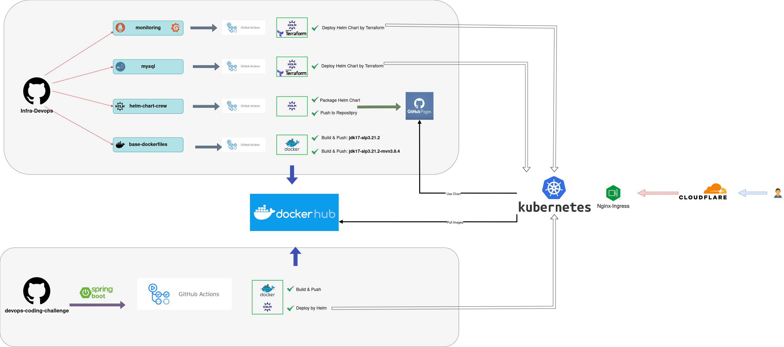
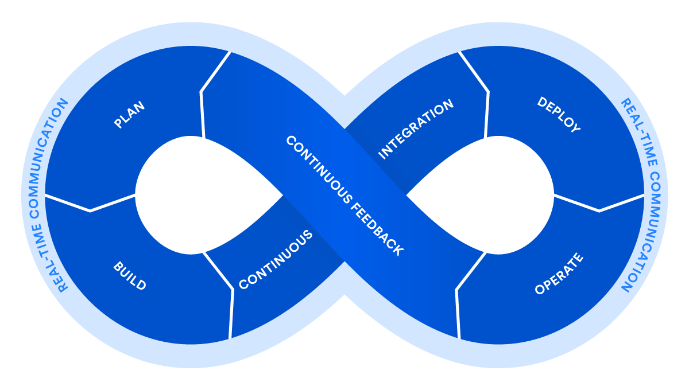

# Crewmeister DevOps Challenge

## Overview

This repository contains my implementation of the Crewmeister DevOps Engineer Challenge, showcasing an automated CI/CD pipeline for a Spring Boot application and DevOps tools using Docker, Helm, Terraform, and GitHub Actions. Additionally, Prometheus and Grafana are integrated for monitoring to ensure seamless application performance.

##  Infrastructure DevOps Repository

I created the [`infra-devops`](https://github.com/hesam-rad/infra-devops)  repository to manage infrastructure, CI/CD pipelines, and deployment configurations for the Crewmeister challenge. This repository includes Kubernetes deployments, Helm charts, Terraform configurations, and GitHub Actions workflows.

### 📂 Repository Structure

### 1️⃣ Base Dockerfiles
- Created custom Dockerfiles for base images used in other projects.
- Implemented GitHub Actions to build and push images to Docker Hub.
  
**Docker Hub Repository:** [hesamrad/crew](https://hub.docker.com/repository/docker/hesamrad/crew)

**Docker Hub Images:**
- `Jdk17-alp3.21.2`
- `jdk17-alp3.21.2-mvn3.8.4`

### 2️⃣ Monitoring (Prometheus & Grafana)
- Implemented CI/CD pipelines to deploy Prometheus and Grafana on Kubernetes.
- Used Terraform to automate the deployment via Helm charts.

**Grafana Dashboard:** [grafana.hesambodaqirad.ir](http://grafana.hesambodaqirad.ir)  
**Credentials:** `admin:b2c8ec0364eaae9375f1dd2e`

### 3️⃣ MySQL
- Configured CI/CD pipelines for MySQL deployment on Kubernetes.
- Used Terraform and Helm for automated database deployment.
  
**MySQL DNS:** `mysql.database.svc`

### 4️⃣ Helm Chart for Application (helm-chart-crew)
- Developed a generic Helm chart to support applications like Spring Boot microservices, PHP, etc.
- Configured GitHub Pages to host and distribute Helm charts.

**Helm Chart Repository:** Hosted on the [`pg-helm`](https://github.com/hesam-rad/infra-devops/tree/pg-helm) branch of `infra-devops`.

**Note:**
In projects where I use Terraform in CI/CD, I run terraform `init`, `plan`, and `apply`. However, I don’t store the Terraform state files remotely at the moment due to access limitations. That said, I’m aware of best practices for managing Terraform state using remote backends such as S3, Blob Storage, GitLab, and Terraform Cloud.

---

##  Spring Boot Application Repository

This [`repository`](https://github.com/hesam-rad/devops-coding-challenge) contains the Crewmeister Spring Boot application along with its Docker and deployment configurations.

### Enhancements & DevOps Configurations

#### 1️⃣ Dockerization
- Implemented a multi-stage Dockerfile for efficient container builds.
- Used custom base images from `infra-devops/base-dockerfiles`.

#### 2️⃣ Monitoring
- Integrated Micrometer into `pom.xml` for enhanced observability with Prometheus.

#### 3️⃣ Deployment
- Used `helm-chart-crew` from `infra-devops` to deploy the application via Helm.

**Note:**
In my Kubernetes deployments, I manually create secrets like crew-app-secret 🔐. However, for production environments, I understand the importance of using secure secret management tools such as HashiCorp Vault 🗝️, AWS Secrets Manager ☁️, and Azure Key Vault 🔒. I am also familiar with integrating these tools with Kubernetes using providers like Kubernetes External Secrets for secure and seamless secret management 🔒.

---

## CI/CD GitHub Actions

Each component of the infrastructure and application is managed via GitHub Actions:

- **Base Dockerfiles** → Build & Push to Docker Hub
- **Monitoring (Prometheus & Grafana)** → Terraform + Helm for automated deployment
- **MySQL** → Terraform + Helm for database deployment
- **Helm Chart Crew** → CI/CD for packaging & publishing charts to GitHub Pages
- **Spring Boot App** → Multi-stage Docker build + Helm deployment via GitHub Actions

---

## Deployment URLs

- **Application URL:** [app.hesambodaqirad.ir](http://app.hesambodaqirad.ir)
- **Spring Boot Grafana Dashboard URL:** [grafana.hesambodaqirad.ir](https://grafana.hesambodaqirad.ir/d/spring_boot_212/spring-boot-3-x-statistics?orgId=1&from=now-1h&to=now&timezone=browser&var-application=&var-Namespace=develop&var-pod=crewmeister-app-helm-chart-crew-5b6b478fd8-gcsjc&var-hikaricp=HikariPool-1&var-memory_pool_heap=$__all&var-memory_pool_nonheap=$__all)
